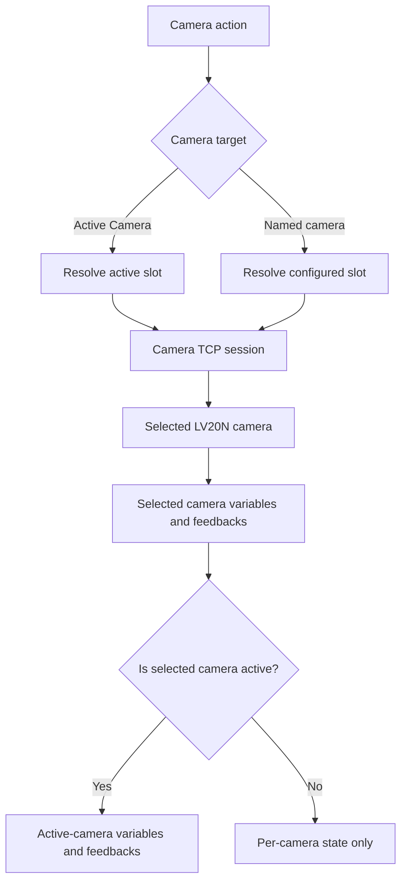
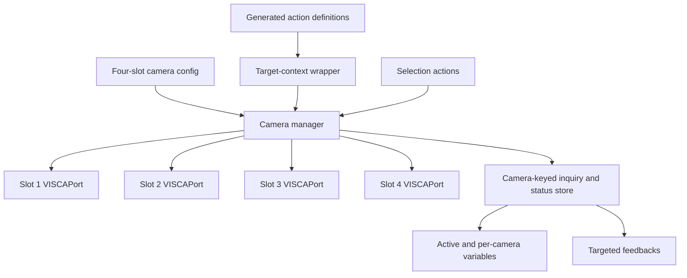

# Multi-Camera Control - Plan

## Goal Capsule

- **Objective:** Let one AVKANS VISCA Companion connection control up to four named LV20N cameras without duplicating the control surface for each camera.
- **Product authority:** This contract defines camera selection, action targeting, safety behavior, and the variables and feedbacks exposed by the module.
- **Open blockers:** None. Implementation planning may choose internal connection-management and option-generation patterns without changing the behavior below.
- **Execution profile:** Implement as a code change with test-first coverage for configuration, routing, switching, state projection, and action/feedback generation.
- **Stop conditions:** Stop if Companion cannot safely isolate concurrent action targets or if the current module API cannot refresh definitions after a roster change.
- **Tail ownership:** The implementation owns documentation, package versioning, installable packaging, pull-request checks, and read-only validation against the available LV20N.

---

## Product Contract

### Summary

One Companion connection will manage up to four named AVKANS LV20N cameras. Every camera-control action will target either the active camera or one explicitly selected configured camera, while variables and feedbacks expose complete state globally and per camera.

### Problem Frame

The module currently represents one camera per Companion connection, so a shared PTZ control surface must either be duplicated for every camera or manually rebound. The operator needs one set of controls that can change its default target while retaining the option to pin individual actions to a configured camera.

### Key Decisions

- **One connection manages four named cameras.** (session-settled: user-directed — chosen over separate Companion connections: one reusable control surface should operate all cameras.) Governs R1-R4.
- **Actions offer configured targets only.** (session-settled: user-directed — chosen over custom IP or variable targets: the first version should present a predictable dropdown.) Governs R5-R6.
- **Support both global selection and action-level targeting.** (session-settled: user-directed — chosen over either mechanism alone: normal controls should follow the active camera while pinned controls remain possible.) Governs R5-R8.
- **Stop the previous camera before changing the active target.** (session-settled: user-directed — chosen over leaving movement running or stopping every camera: prevent runaway movement without interrupting unrelated cameras.) Governs R9-R10.
- **Expose global and per-camera observability.** (session-settled: user-directed — chosen over variables-only or feedbacks-only: Companion buttons need both display values and state-driven styling.) Governs R11-R15.
- **Do not preserve the single-camera configuration contract.** (session-settled: user-directed — chosen over legacy migration: the module currently has one user and can adopt the cleaner multi-camera configuration directly.) Governs R16.

### Actors

- A1. **Operator:** Chooses the active camera and runs PTZ, image, preset, power, network, and inquiry actions.
- A2. **Companion:** Executes actions and renders variables and feedback-driven button states.
- A3. **Configured camera:** One of up to four named LV20N cameras managed independently by the connection.

### Requirements

**Camera roster and connections**

- R1. The connection must support up to four configured camera slots, each with a display name and IP address.
- R2. Each configured camera must maintain an independent connection state so an unavailable camera does not prevent actions from reaching another available camera.
- R3. Empty camera slots must not appear as selectable targets and must be skipped by camera-cycling actions.
- R4. The first configured camera must become active when the module starts or when the previous active slot is no longer configured.

**Action targeting and selection**

- R5. Every action that communicates with a camera must begin with a Camera target dropdown containing Active Camera followed by each configured camera in slot order.
- R6. Camera target options must not accept custom IP addresses, Companion expressions, or variable-derived targets in this version.
- R7. An action targeting Active Camera must resolve the target when the action executes.
- R8. The module must provide actions to select a configured camera directly and to select the next or previous configured camera with wraparound.

**Safe switching**

- R9. Before changing the active camera, the module must attempt to stop pan/tilt, zoom, and focus movement on the previously active camera.
- R10. A failed stop attempt must be reported but must not prevent the operator from selecting and controlling another configured camera.

**Variables and feedbacks**

- R11. The module must expose active-camera variables for slot number, configured name, IP address, and connection status.
- R12. Each configured camera slot must expose variables for configured name, IP address, connection status, active state, last inquiry ID, last formatted inquiry result, last raw response, and every decoded inquiry field supported by the module.
- R13. Inquiry actions must update the variables belonging to the camera that received the inquiry.
- R14. The module must provide feedbacks for active-camera selection and per-camera connection status so selector and status buttons can be styled without expressions.
- R15. Existing inquiry-result feedback behavior must be available for each configured camera and must evaluate the state belonging to the feedback's selected camera target.

**Configuration boundary**

- R16. The multi-camera configuration may replace the existing single-camera configuration without migrating or preserving existing saved connection settings.

### Control and State Flow

### Key Flows

- F1. Select a camera directly
  - **Trigger:** The operator runs the direct camera-selection action.
  - **Actors:** A1, A2, A3
  - **Steps:** Companion validates that the slot is configured, attempts the movement stops required by R9, changes the active slot, and refreshes active-camera variables and feedbacks.
  - **Outcome:** Unpinned controls now target the selected camera.
  - **Covers:** R3-R4, R8-R11, R14.
- F2. Cycle through cameras
  - **Trigger:** The operator runs Next Camera or Previous Camera.
  - **Actors:** A1, A2, A3
  - **Steps:** Companion finds the next configured slot in the requested direction, wraps at the roster boundary, applies the safe switch, and skips empty slots.
  - **Outcome:** The active camera advances predictably through the configured roster.
  - **Covers:** R3-R4, R8-R10.
- F3. Run an ordinary control
  - **Trigger:** The operator runs any camera-control action.
  - **Actors:** A1, A2, A3
  - **Steps:** Companion resolves Active Camera or the explicitly selected configured camera and sends the command through that camera's connection.
  - **Outcome:** Only the resolved target receives the command.
  - **Covers:** R2, R5-R7.
- F4. Run an inquiry
  - **Trigger:** The operator runs an inquiry action against the active camera or a specific configured camera.
  - **Actors:** A1, A2, A3
  - **Steps:** Companion resolves the target, collects the response, and updates that camera's inquiry state; active-camera surfaces update only when that camera is active.
  - **Outcome:** Inquiry state remains attributable to the camera that produced it.
  - **Covers:** R5-R7, R11-R15.

### Acceptance Examples

- AE1. Active-camera default
  - **Covers:** R4-R5, R7.
  - **Given:** Cameras 1 and 2 are configured and Camera 1 is active.
  - **When:** The operator runs Pan Left with Camera target set to Active Camera.
  - **Then:** Only Camera 1 receives the movement command.
- AE2. Explicit action target
  - **Covers:** R5-R7.
  - **Given:** Camera 1 is active and Camera 2 is configured.
  - **When:** The operator runs Recall Preset with Camera target set to Camera 2.
  - **Then:** Only Camera 2 receives the recall and Camera 1 remains active.
- AE3. Safe active-camera switch
  - **Covers:** R8-R10.
  - **Given:** Camera 1 is moving and Camera 2 is configured.
  - **When:** The operator selects Camera 2.
  - **Then:** The module attempts to stop pan/tilt, zoom, and focus on Camera 1 before making Camera 2 active.
- AE4. Offline previous camera
  - **Covers:** R2, R8-R10.
  - **Given:** Camera 1 is active but unreachable and Camera 2 is connected.
  - **When:** The operator selects Camera 2.
  - **Then:** The failed stop attempt is reported, Camera 2 becomes active, and subsequent active-camera actions reach Camera 2.
- AE5. Cycling sparse slots
  - **Covers:** R3-R4, R8.
  - **Given:** Only Cameras 1 and 4 are configured and Camera 1 is active.
  - **When:** The operator runs Next Camera.
  - **Then:** Camera 4 becomes active; running Next Camera again returns to Camera 1.
- AE6. Per-camera inquiry state
  - **Covers:** R11-R15.
  - **Given:** Camera 1 is active and Camera 2 is configured.
  - **When:** A power inquiry explicitly targets Camera 2.
  - **Then:** Camera 2's power and last-inquiry surfaces update while Camera 1's inquiry state remains unchanged.

### Scope Boundaries

- Support is limited to four configured camera slots.
- Action targets are limited to Active Camera and configured camera slots.
- Custom IP targets and Companion variable or expression targets are deferred.
- More than four cameras and a dynamically sized roster are deferred.
- Migration of existing single-camera settings is excluded.
- Coordinated commands sent to multiple cameras at once are excluded.

### Dependencies and Assumptions

- Every configured camera is an AVKANS LV20N using the command and inquiry system already supported by this module.
- The four cameras are expected to share the connection's VISCA TCP port and transport-mode settings; a future requirement is needed if individual cameras require different values.
- Companion can refresh action and feedback definitions after the configured camera roster changes.

### Sources

- `src/config.ts` defines the current single-camera connection settings.
- `src/instance.ts` owns the current camera connection and shared command and inquiry entry points.
- `src/actions/actions.ts` combines every camera-facing action definition.
- `src/actions/lv20n-inquiries.ts` and `src/camera/lv20n-inquiry.ts` define the inquiry state that must become camera-specific.

---

## Planning Contract

### Key Technical Decisions

- KTD1. **Use one `VISCAPort` per configured camera slot.** A camera manager owns creation, reconciliation, connection status, and disposal for the four independent sessions. This implements R1-R4 without changing the VISCA packet layer.
- KTD2. **Use callback-scoped target context for existing action definitions.** Add the shared Camera target option and wrap camera-facing callbacks at the action aggregation boundary. Resolve each callback through an async-safe scoped context so concurrent actions cannot leak targets. This implements R5-R7 while preserving the catalog and legacy action implementations.
- KTD3. **Keep selection actions outside target wrapping.** Direct, next, and previous selection actions operate on the active-slot state rather than on their own Camera target option. This keeps the selector semantics distinct from ordinary camera commands and implements R8-R10.
- KTD4. **Project one camera-keyed state store into scoped and active aliases.** Inquiry results and status are stored by configured slot. Variable and feedback helpers generate per-slot surfaces, while active-camera surfaces mirror only the current slot. This implements R11-R15.
- KTD5. **Aggregate module health without allowing one camera to dominate.** The Companion connection reports OK when at least one configured camera is connected, Connecting when no camera is connected but at least one is connecting, Connection Failure when all configured cameras fail, and Disconnected when no slots are configured. Per-camera variables and feedbacks carry the detailed state.
- KTD6. **Bound safe-switch stop attempts.** The manager attempts the three motion-stop commands against the previous camera and waits only for a short bounded settlement before selecting the new slot. This satisfies R9-R10 without allowing an unreachable camera to trap control.
- KTD7. **Replace rather than migrate the connection config.** (session-settled: user-directed — chosen over legacy migration: the module has one current user and the multi-camera shape should stay clean.) Remove obsolete single-camera config upgrades while retaining unrelated action upgrades. This implements R16.

### High-Level Technical Design

The camera manager is the only component that maps a camera target to a live session. `VISCAPort` remains responsible for VISCA framing, sequencing, parsing, timeouts, and reconnect behavior. The instance remains the Companion adapter and delegates routing and state queries to the manager.

### System-Wide Impact

- **Configuration:** The saved connection shape changes from one host to four name/IP pairs with shared port, transport, and debug settings.
- **Runtime lifecycle:** One module instance can own four concurrent TCP sessions and must close every session on reconfiguration and destruction.
- **Actions and presets:** Every camera-facing action gains a leading target option. Existing module presets omit the option and therefore resolve to Active Camera.
- **Variables and feedbacks:** Variable cardinality grows by four scoped copies of the inquiry catalog plus active aliases. Feedback definitions depend on the current roster.
- **Status and logging:** Per-camera status must remain attributable by slot/name while the Companion instance status is aggregated.

### Risks and Mitigations

- **Concurrent target leakage:** A global mutable current target could route overlapping callbacks incorrectly. KTD2 requires async-safe callback scoping and concurrency tests.
- **Runaway movement during selection:** A stop command can fail or hang. KTD6 bounds the wait, logs failures, and continues the switch.
- **Definition drift:** Actions, variables, and feedbacks could disagree about configured names or empty slots. Generate all camera choices from one roster helper and test the exact ordering.
- **State misattribution:** Inquiry responses could update the active camera after the selection changes. Capture the resolved slot before sending and write the response to that slot.
- **Connection fan-out:** Four reconnecting sockets produce more logs and status transitions. Prefix camera logs and aggregate module health per KTD5.

### Sequencing

Implement U1 through U5 in dependency order. U2 establishes the runtime boundary consumed by target routing in U3 and state projection in U4. U5 updates the user-facing contract and validates the complete integration.

---

## Implementation Units

### U1. Define the four-camera configuration and roster model

- **Goal:** Replace the single-camera connection shape with four validated name/IP slots and shared transport settings.
- **Requirements:** R1, R3-R4, R16; KTD7.
- **Dependencies:** None.
- **Files:** `src/config.ts`, `src/config.test.ts`, `src/upgrades.ts`.
- **Approach:**
  1. Define stable slot and target types for camera numbers 1 through 4.
  2. Generate four name/IP config groups with default names and optional hosts.
  3. Validate hosts into a compact ordered roster and expose helpers for configured choices and first-slot fallback.
  4. Treat port and transport mode as shared settings and remove single-camera config migration logic.
- **Patterns to follow:** Preserve defensive `RawConfig` validation and branded host checks in `src/config.ts`.
- **Execution note:** Start with failing config tests because later units depend on exact roster semantics.
- **Test scenarios:**
  1. A default config exposes four named slots, no configured cameras, raw transport, and port 1259.
  2. Valid hosts in sparse slots produce an ordered roster while empty/invalid hosts are excluded.
  3. Blank names fall back to Camera 1 through Camera 4.
  4. The first configured slot becomes the fallback active slot when slot 1 is empty.
  5. Configuration changes compare all camera slots plus shared port and transport values.
- **Verification:** Config tests prove the exact saved-field defaults, roster order, validation, and restart boundary.

### U2. Add independent camera-session management

- **Goal:** Own one VISCA session, status, and lifecycle per configured camera while preserving the existing transport implementation.
- **Requirements:** R2-R4, R9-R10; KTD1, KTD5-KTD6.
- **Dependencies:** U1.
- **Files:** `src/cameras.ts`, `src/cameras.test.ts`, `src/instance.ts`, `src/visca/port.ts`.
- **Approach:**
  1. Introduce a camera manager keyed by configured slot with an adapter that prefixes logs and records each port's status.
  2. Reconcile ports on configuration changes so unchanged sessions survive and removed/changed sessions close cleanly.
  3. Route command and inquiry promises through an explicitly resolved slot.
  4. Implement direct and cyclic active-slot changes, including safe motion stops and a bounded failure path.
  5. Aggregate the Companion instance status according to KTD5 and close all sessions during destruction.
- **Patterns to follow:** Reuse `VISCAPort` for transport behavior and the existing error suppression/logging semantics in `src/instance.ts`.
- **Execution note:** Use deterministic fake ports or local mock sockets; do not require physical cameras for unit tests.
- **Test scenarios:**
  1. Two configured slots open distinct sessions and route commands to the requested slot.
  2. One failed camera does not prevent a connected camera from receiving commands.
  3. Reconfiguring one slot closes/replaces only that slot's session.
  4. Covers AE3. A direct switch attempts pan/tilt, zoom, and focus stops before changing the active slot.
  5. Covers AE4. A failed or timed-out stop is logged and the requested camera still becomes active.
  6. Covers AE5. Next and previous wrap through configured slots and skip empty slots.
  7. Destroy closes every camera session and leaves no reconnect loop active.
- **Verification:** Manager tests prove independent lifecycles, routing, status aggregation, safe switching, and cleanup.

### U3. Add camera targeting and selection actions

- **Goal:** Give every camera-facing action a consistent target dropdown and add direct/next/previous active-camera controls.
- **Requirements:** R5-R8; KTD2-KTD3.
- **Dependencies:** U1-U2.
- **Files:** `src/actions/camera-target.ts`, `src/actions/camera-target.test.ts`, `src/actions/camera-selection.ts`, `src/actions/camera-selection.test.ts`, `src/actions/actions.ts`, `src/actions/actionid.ts`, `src/instance.ts`, `src/presets.ts`.
- **Approach:**
  1. Generate the target dropdown from the roster with Active Camera first and configured slots after it.
  2. Wrap ordinary action callbacks with async-safe target context before exposing their definitions to Companion.
  3. Exclude selection actions from the wrapper and implement direct, next, and previous actions against the manager.
  4. Rebuild action and preset definitions after roster changes so names and empty-slot filtering remain current.
- **Patterns to follow:** Extend `getActions()` as the single aggregation boundary and preserve existing action IDs and callback bodies.
- **Execution note:** Characterize the existing action count and representative callbacks before wrapping them.
- **Test scenarios:**
  1. Every existing camera-facing action begins with Active Camera followed by configured slots in slot order.
  2. Empty slots are absent and configured display names appear in choices.
  3. Covers AE1. An Active Camera action resolves to the current slot at execution time.
  4. Covers AE2. A pinned Camera 2 action reaches Camera 2 without changing the active slot.
  5. Two overlapping asynchronous callbacks retain different target slots without leakage.
  6. Direct, next, and previous selector actions do not receive a Camera target option.
  7. Existing module presets with no stored target option resolve to Active Camera.
- **Verification:** Action tests prove option coverage, ordering, concurrency isolation, selectors, and preset defaults across both catalog-generated and legacy actions.

### U4. Scope inquiries, variables, and feedbacks by camera

- **Goal:** Attribute every inquiry and status value to its camera and expose active and per-camera Companion surfaces.
- **Requirements:** R11-R15; KTD4.
- **Dependencies:** U1-U3.
- **Files:** `src/camera-state.ts`, `src/camera-state.test.ts`, `src/variables.ts`, `src/actions/lv20n-inquiries.ts`, `src/actions/lv20n-inquiries.test.ts`, `src/feedbacks.ts`, `src/feedbacks.test.ts`, `src/instance.ts`.
- **Approach:**
  1. Store status, last-inquiry metadata, formatted results, raw responses, and decoded fields by configured slot.
  2. Generate stable per-slot variable IDs and active aliases from shared inquiry-definition helpers.
  3. Capture the resolved target before an inquiry is sent and update only that slot when its response returns.
  4. Refresh active aliases and feedbacks after selection, status, or active-camera inquiry changes.
  5. Add active-camera and connection feedbacks and add target selection to existing inquiry value/equality feedbacks.
- **Patterns to follow:** Extend the catalog-driven variable generation in `src/variables.ts` and feedback caching in `src/feedbacks.ts`.
- **Test scenarios:**
  1. Variable definitions are unique and include active aliases plus complete Camera 1 through Camera 4 scopes.
  2. Camera roster and status changes update name, IP, active, and connection-state variables for the correct slot.
  3. Covers AE6. An inquiry targeting Camera 2 updates Camera 2 state while Camera 1 remains unchanged.
  4. An inquiry response that completes after active-camera selection changes remains attributed to its original slot.
  5. Active aliases mirror the newly selected slot immediately.
  6. Active-camera, connection-status, inquiry-value, and inquiry-equality feedbacks evaluate the selected camera state.
  7. Feedback target choices use Active Camera followed by configured slots and skip empty slots.
- **Verification:** State, inquiry, variable, and feedback tests prove complete attribution and projection for all supported inquiry fields.

### U5. Document, package, and validate the multi-camera release

- **Goal:** Make the new configuration and control workflow installable and understandable, then verify the integrated module.
- **Requirements:** R1-R16.
- **Dependencies:** U1-U4.
- **Files:** `README.md`, `companion/HELP.md`, `package.json`, `docs/solutions/design-patterns/workbook-driven-visca-catalogs.md`.
- **Approach:**
  1. Document the four-slot roster, shared transport settings, target dropdown, selection actions, safe switching, and scoped variables/feedbacks.
  2. State that single-camera settings are not migrated and that custom IP/variable targets are deferred.
  3. Bump the module minor version and build the installable Companion package.
  4. Run a read-only inquiry smoke test against the available LV20N and use mock-camera tests for multi-session behavior.
- **Patterns to follow:** Keep the existing workbook/transport documentation and package workflow.
- **Test scenarios:**
  1. Package output contains the updated help, manifest, and compiled module.
  2. Read-only power, version, and IP-info inquiries still succeed against `10.201.0.50` using raw TCP.
  3. No live movement, reset, or network-changing command is sent during validation.
- **Verification:** Full quality gates pass, the package builds with the new version, and the read-only camera smoke test succeeds.

---

## Verification Contract

| Gate                       | Command or evidence                              | Covers                                       |
| -------------------------- | ------------------------------------------------ | -------------------------------------------- |
| Unit and integration tests | `yarn test`                                      | U1-U4 and all linked AEs                     |
| Type safety                | `yarn check-types`                               | U1-U5                                        |
| Lint and formatting        | `yarn lint` and `git diff --check`               | U1-U5                                        |
| Unused-code analysis       | `yarn knip`                                      | U1-U5                                        |
| Build                      | `yarn build`                                     | U1-U5                                        |
| Installable package        | `yarn package` and archive inspection            | U5                                           |
| Physical-camera smoke      | Read-only inquiries against `10.201.0.50:1259`   | Existing raw transport and U2/U4 integration |
| Pull-request checks        | All required GitHub checks complete successfully | Entire plan                                  |

Physical-camera validation must remain read-only. Multi-camera routing, selection stops, sparse cycling, and failure behavior are proven with mock sessions rather than production camera movement.

---

## Definition of Done

- U1-U5 are implemented in dependency order and every unit's test scenarios pass.
- All R1-R16 behaviors are represented by automated tests or the explicitly read-only physical-camera smoke test.
- Every camera-facing action exposes the required target dropdown, and selector actions remain unwrapped.
- Each configured camera has an independent session, state, variables, and feedbacks.
- Safe switching cannot hang indefinitely on an unavailable previous camera.
- Documentation and the installable package describe the shipped behavior and deferred targeting modes.
- The full Verification Contract passes locally and in GitHub CI.
- No abandoned experiments, duplicate routing paths, stale single-camera config code, or unrelated edits remain in the final diff.
